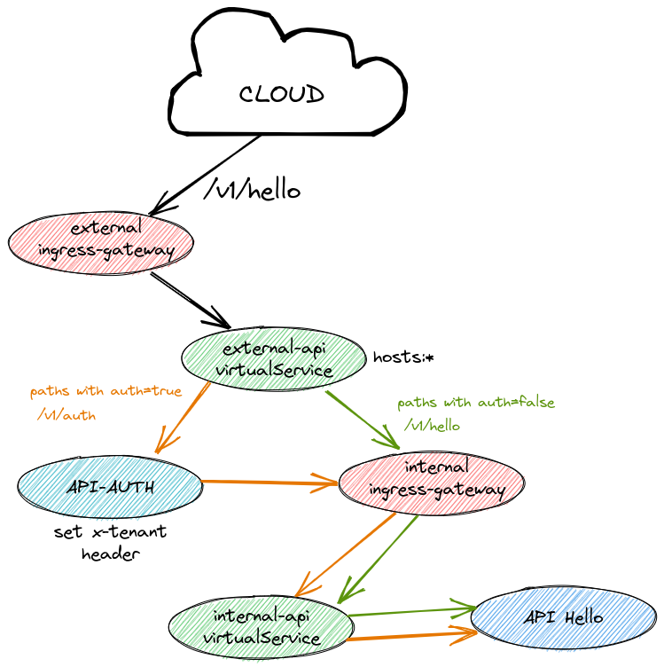

Authentication service case:



There are two gateways. The external one is responsible to redirect request to
internal gateway if authentication method isn't present, or redirect to auth
engine if method is present (example: ```auth: "auth-v1"```)

the auth gateway after authenticate te request, call the internal gateway that
is responsible to route the request to specific API.

the example bellow is an api values to set up endpoint configs:
```
gateway:
  routes:
  - name: "hello"
    path: "/hello/v1/sayHello"
    auth: "auth-v1"
```
